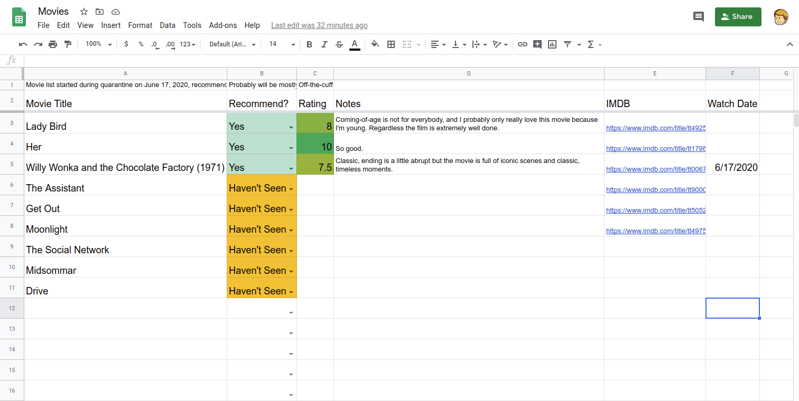

# Movie-Sheets
My tool for automating my google sheets movie list

I chose to use google sheets because it's a simple way to store data that I also want to share. Google sheets also has relatively intuitive and nice looking conditional formatting tools that I wanted to learn more about.

The nice thing about sheets as well is you can programatically insert data using python, and the formatting rules will apply to the newly added data, you don't need to program in formatting as you enter data.

# How to use
Once everything is configured, run `python3 moviesheets.py` with python3. The program will ask you the name of the movie you want to add/edit. 

If the movie isn't already in your spreadsheet it assumes you want to add it to the database. If you input an exact match then the program will immediately ask you what you want to edit about the movie, but if you input something that is similar (using levenshtein distance as a metric for simplicity's sake) to other movies in the spreadsheet then it will ask you if it's any of those.

The program will then ask you a series of questions related to the movie (do you recommend, which movie on IMDB are you referring to specifically, numeric rating, notes pertaining to your review), once answered it adds a new row to your spreadsheet with the data you entered.

# Dependencies
imdbpy

gspread

oauth2client

python-Levenshtein

# Credits
thanks to:

https://www.twilio.com/blog/2017/02/an-easy-way-to-read-and-write-to-a-google-spreadsheet-in-python.html

https://imdbpy.github.io/
